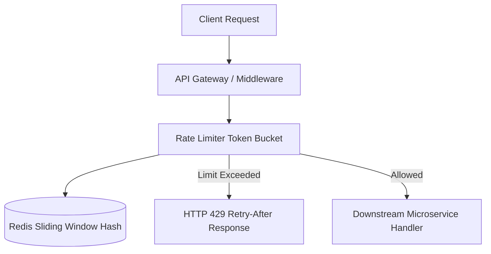

# Skeleton-of-Thought (SoT) & Graph-of-Thoughts (GoT) Architecture Example

## Scenario: Designing a Real-Time Distributed Rate Limiter

When prompted to build a complex, multi-service architecture, **KS Cognitive Engine** first constructs a Directed Acyclic Graph (DAG) of the system before emitting code.

### 1. Skeleton Phase (Interfaces & Data Contracts)
* **Contract:** Define the rate limiter options, sliding window window in seconds, and capacity.
* **Storage Interface:** Decouple Redis client from core algorithm to allow in-memory testing.

### 2. Implementation Phase (Clean, Thread-Safe Code)
* Implement Lua script for atomic sliding window token checking.
* Return standardized rate limit headers (`X-RateLimit-Limit`, `X-RateLimit-Remaining`, `X-RateLimit-Reset`).
